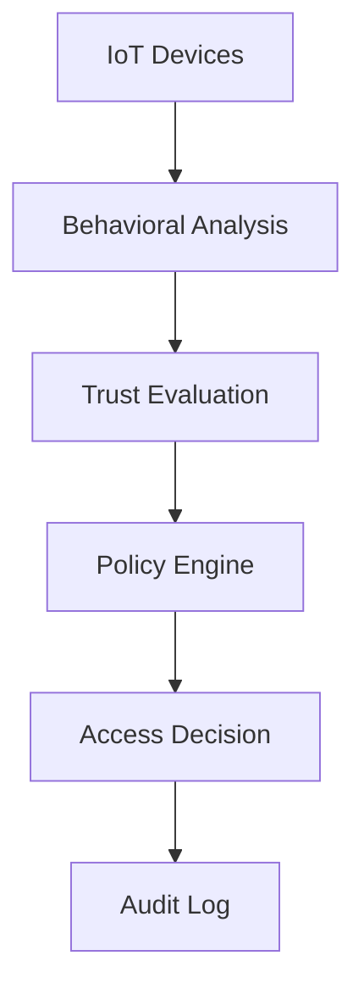

# Dynamic Access Control Model

> **Based on User Access Behavior in IoT Environment**

## 📋 Project Overview

This project presents a comprehensive **Dynamic Access Control Model** designed to address critical security challenges in IoT environments, specifically targeting the semiconductor industry. Our solution combines machine learning algorithms with behavioral analysis to prevent unauthorized access and data leakage.

**Course:** Data Analytics Consulting  
**Team:** Group 9  
**Focus Industry:** Semiconductor Manufacturing

---

## ⚠️ Problem Statement

### Critical Security Challenges

#### 🔓 **Data Leakage Risk**
- Sensitive assets (IC designs, manufacturing recipes) exposed to unauthorized access
- Unidentified devices accessing restricted information
- Lack of real-time threat detection

#### 💰 **Cost Impact** 
- Threatens intellectual property and competitive advantage
- Compromises operational integrity
- Potential for significant financial losses

#### 📍 **Device Management Issues**
- Log devices appearing in restricted zones inappropriately
- Lack of centralized control over device placement
- Insufficient monitoring of device behavior patterns

---

## 🔧 Solution Architecture

Our three-component approach provides comprehensive access control:

### 1. **Frequent Access Path Analysis**
```
🔍 Algorithm: Apriori's Algorithm
📊 Purpose: Retrieve and analyze frequent access patterns
🎯 Outcome: Baseline behavioral profiles
```

### 2. **Access Evaluation Module**
```
⏱️ Time Constraints: Temporal access analysis
📍 Space Constraints: Location-based validation  
🛡️ Trust Calculation: Dynamic trust level scoring
```

### 3. **Dynamic Access Control**
```
🧠 Trust Integration: Combines behavioral trust scores
📋 Policy Matching: Real-time policy evaluation
✅ Authorization: Intelligent access decisions
```

---

## 🚀 Demo & Prototype

Experience our dynamic access control system through interactive demonstrations:

### Live Demos
- **[Settings Demo](https://endearing-kitten-f4175d.netlify.app/settings.html)** - Configure access control parameters
- **[Generator Demo](https://endearing-kitten-f4175d.netlify.app/generator.html)** - Generate access policies and rules

### Interactive Prototype
- **[Figma Prototype](https://www.figma.com/proto/uJbZITlKL3ZUOBKW8nfJ6t/Final-Project-prototype?page-id=5%3A70&node-id=5-399&node-type=canvas&viewport=2177%2C632%2C0.42&t=z26cYzwaOydgaDEq-1&scaling=min-zoom&content-scaling=fixed&starting-point-node-id=5%3A399)** - Complete user interface walkthrough

---

## ⭐ Key Features

| Feature | Description | Impact |
|---------|-------------|---------|
| 🔍 **Behavioral Analysis** | Machine learning-based user behavior tracking | Proactive threat detection |
| 🛡️ **Dynamic Authorization** | Real-time access control decisions | Immediate security response |
| 📍 **Zone Management** | Location-based access restrictions | Granular control over physical access |
| ⏱️ **Temporal Constraints** | Time-sensitive access controls | Context-aware security |
| 🧠 **Trust Scoring** | Continuous trust level evaluation | Adaptive security posture |
| 📊 **Pattern Recognition** | Apriori algorithm implementation | Data-driven decision making |

---

## 🔄 Industry Replicability

This solution framework can be adapted across multiple sectors:

| Industry | Use Case | Benefits |
|----------|----------|----------|
| **🏭 Semiconductor** | Manufacturing facility security | IP protection, zone management |
| **🏢 Data Centers** | Server room access control | Infrastructure protection |
| **🏦 Banking & Finance** | Secure facility management | Regulatory compliance |
| **🔬 Research Centers** | Laboratory access control | Research data protection |

---

## 🛠️ Technical Implementation

### Core Technologies
- **Machine Learning**: Behavioral pattern analysis
- **IoT Security**: Device authentication and monitoring
- **Data Analytics**: Real-time decision processing
- **Algorithm**: Apriori for frequent pattern mining

### System Architecture


---

## 📊 Results & Impact

### Security Improvements
- **Reduced Data Leakage**: Proactive identification of suspicious access patterns
- **Enhanced Compliance**: Automated policy enforcement
- **Real-time Response**: Immediate threat mitigation

### Operational Benefits
- **Streamlined Access Management**: Automated decision-making process
- **Reduced Administrative Overhead**: Self-managing security policies
- **Improved Audit Trail**: Comprehensive access logging


---

## 📚 References

1. **Semiconductors Industry Association.** (2024, October 16). 2024 state of the industry report underscores opportunities and challenges for U.S. chip industry. *Semiconductors.org*

2. **Fan, S., Zhu, X., Kuo, K.-C., Lu, C., & Wu, Q.** (2017). An efficient intranet architecture scheme based on regional function and security requirement in semiconductor manufacturing enterprises. *Proceedings of the 2017 IEEE International Conference on Industrial Engineering and Engineering Management (IEEM)*

3. **Cycuity.** (2024). Why semiconductor security is more important than ever in 2024. *Cycuity Blog*

4. **Mou, K., & Chen, G.-H.** Risk management in semiconductor industry. *Powerchip Semiconductor Corporation*. IEEE Xplore

5. **Zhang, X.** "Dynamic access control model based on user access behavior in the Internet of Things environment," *2022 4th International Conference on Frontiers Technology of Information and Computer (ICFTIC)*, Zhengzhou, China, 2022, pp. 1020-1023, doi: 10.1109/ICFTIC57696.2022.10075243

---

## 📄 License

This project is part of academic coursework and is available for educational purposes.
